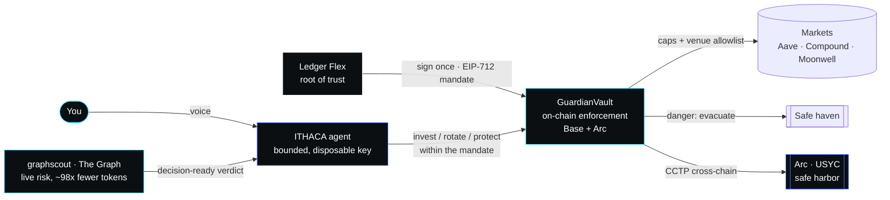

# ITHACA

### Autonomous yield that always comes home.

**ITHACA is a voice-first, self-custodial AI that grows your stablecoins across the best on-chain markets — and *physically cannot lose them*.** You sign one mandate on your Ledger. After that, ITHACA senses risk in real time, deploys into the safest paying market, rotates as conditions shift, and the instant danger hits it evacuates everything to a safe haven you approved — even flying it cross-chain to safety. The agent is bounded on-chain: a compromised key can annoy, **never steal**.

Built for **ETHOnline 2026** across three sponsors — **The Graph**, **Ledger**, and **Circle / Arc** — and live on-chain today.

<p>
  <b>LIVE:</b> <a href="https://guardian-rho-two.vercel.app">guardian-rho-two.vercel.app</a> &nbsp;·&nbsp;
  <b>Base Sepolia + Arc testnet</b> &nbsp;·&nbsp; <b>Self-custodial</b> &nbsp;·&nbsp; <b>Voice-controlled</b>
</p>

---

## Why ITHACA

In 2026 every wallet drowns in data and every AI agent got a wallet — but **none got brakes**. Spend limits live in software and are bypassable; one hallucination or one leaked key and the funds are gone. ITHACA is the missing safety layer: a **protection-first, state-aware, on-chain-enforced** autonomous agent. It's the difference between a gas pedal and a car with a nervous system and brakes.

- **SEE** — reads live on-chain risk through The Graph (via **graphscout**, our intelligence layer).
- **BOUND** — a single Ledger-signed EIP-712 mandate defines exactly what the agent may ever do.
- **ACT & PROTECT** — deploys, rotates, and evacuates autonomously *inside those bounds*, 24/7, hands-off.

---

## What we built (and shipped)

### 1. graphscout — the intelligence layer on The Graph  ·  *`/graphscout`*
The raw Subgraph MCP hands an agent a firehose: it must discover the subgraph, read a ~20K-token schema, hand-write GraphQL, then *become a DeFi analyst* to interpret raw rows. **graphscout collapses all of that into one semantic call** — `assess_risk({ protocol })` → a decision-ready verdict (score, `healthy/watch/elevated/critical`, findings, evidence). It derives what raw rows can't: utilization, liquidation spikes, market concentration, TVL trend.

**Benchmarked live vs. the raw Subgraph MCP** (`graphscout/BENCHMARK.md`, reproducible via `src/benchmark.ts`):

| | Raw Subgraph MCP | graphscout | Win |
|---|---|---|---|
| Tokens the model must read (Aave) | ~23,400 | **~203** | **115× fewer** |
| Tokens the model must read (Compound) | ~16,400 | **~204** | **81× fewer** |
| **Average token load** | — | — | **~98× fewer** |
| Agent round-trips per decision | 3+ | **1** | **3× fewer** |
| Output | raw rows | **score + verdict + evidence** | decision-ready |

**~98× fewer tokens, one round-trip instead of three, and a verdict the raw path never produces** — cheaper, faster, and actually decisive. That's what lets a *voice* agent answer in a beat instead of an awkward pause. graphscout also ships as an MCP server (`/graphscout/src`) so any agent can plug it in.

### 2. Ledger — the root of trust  ·  *`/guardian-contracts`, `/ledger-broker`*
Autonomy without a hardware anchor is a liability. ITHACA makes the **Ledger the root of trust**:
- **Sign once, act forever (within bounds).** One EIP-712 `Policy{investCap, protectCap, safeHaven, expiry}` signed on the Flex authorizes the *whole* autonomous policy. The agent gets a **scoped, disposable, revocable** hot key that lives *inside* that boundary — verified on-chain on every action.
- **Hybrid authority.** Routine invest/rotate/protect run autonomously within the signed caps. High-risk, out-of-bounds evacuations require a **fresh, single-use Flex approval** in the moment (`approveAndProtect` — on-chain single-use `Escalation`).
- **USB *and* Bluetooth signing** (Ledger Device Management Kit — WebHID + Web-BLE), plus **Face ID** as a second factor.
- **Ledger Key Ring capability broker** (`/ledger-broker`): the agent's key is vaulted in the device-rooted Key Ring and the agent is handed *scoped capabilities, never the raw key* — with USB-less enrollment for headless hosts.

### 3. Circle / Arc — the safe harbor  ·  *`/guardian-contracts`*
When the storm is bad, ITHACA doesn't just retreat — it **flees cross-chain to Arc, Circle's stablecoin L1**:
- The same Flex-owned autonomous vault is **deployed and live on Arc testnet**.
- **Cross-chain rescue over CCTP V2** — burn on Base → Circle IRIS → mint on Arc — proven end-to-end.
- **USYC-ready**: the vault is venue-agnostic, so on Arc mainnet the yield venue swaps to Circle's **USYC** (tokenized T-bills) with no code change.
- USDC-native throughout.

### 4. Voice is the new control layer  ·  *`/guardian`*
No dashboards, no buttons — you *talk* to ITHACA. A full voice pipeline (**Gemini Live** STT+LLM+TTS, push-to-talk, on-device Face ID) driven through the **ElevenLabs UI** kit (orb + live waveform + conversation). "Put my idle USDC to work" → ITHACA presents graphscout's ranked markets, picks the safest, and acts — all by voice.

---

## Live & verifiable

Everything below is real and on-chain — verify every move yourself.

| | |
|---|---|
| **Live app** | https://guardian-rho-two.vercel.app |
| **Base vault** (Flex-owned, multi-market) | `0x81AEbF68946D62FDf088579A6F6F2c587015e28A` |
| **Base autonomous invest tx** | `0x15558852a1a59a6ff24f1fca4d80e5ad0a936fc6bd8efd0f5ce7da1f54df6e9d` |
| **Arc vault** (Flex-owned) | `0x67ef856e1a95be96aa4Cdbd7B0cF348A6C4dD808` |
| **Arc autonomous invest tx** | `0xbd3df971d5043df3ca8523cc128dcab95402296600a94098e5a4d1d0dd08932d` |
| **Ledger Flex owner** (root of trust) | `0xDeC312D5Fe0eaef03048BE83137f87cE7907A7Da` |
| **Agent** (bounded executor) | `0x975Bb943F18fe44333eF28D18865ca5A5D63c23D` |

Explorers: [Base Sepolia](https://sepolia.basescan.org) · [Arc testnet](https://testnet.arcscan.app)

---

## Demo

**Try it live:** open **[guardian-rho-two.vercel.app](https://guardian-rho-two.vercel.app)** in desktop Chrome or Edge — arm on your Ledger (USB *or* Bluetooth) with Face ID, then watch ITHACA sense the markets, deploy into the safest one, and evacuate on danger, verifying every move on-chain.

**The walkthrough:** a self-contained cinematic deck of the whole story lives in [`guardian-demo/`](guardian-demo) — 11 scenes, a procedural voxel world, one offline file.
- **Watch:** open `guardian-demo/index.html` in Chrome — arrow keys / `1`–`0` to navigate, `N` for presenter notes, `T` for the rehearsal timer, `F` for fullscreen.
- **Record:** open `guardian-demo/index.html?auto=1&chrome=0`, press `F`, and screen-record ~4 minutes — it auto-plays all 11 scenes and rests on the close.

**Demo video:** _(link coming)_

---

## The security model — a stolen key can't steal

The whole design is that the **agent key is deliberately low-privilege**. Steal it and here's *everything* you can do:

| Agent can call | What it does | Can it steal? |
|---|---|---|
| `invest(policy, sig, venue, amount)` | deploy — needs a **Flex-signed** policy, allowlisted venue, ≤ cap | No |
| `deRisk(venue, amount)` | pull funds back **into the owner's vault** | No |
| `rebalance(from, to, amount)` | move between **allowlisted venues** only | No |
| `protect(policy, sig, amount)` | evacuate — only to the **Flex-approved safe haven** | No |
| `ownerWithdraw(amount, to)` | send anywhere | No **onlyOwner** |

A fully compromised agent key **cannot send one dollar to an attacker** — every fund-exit path needs a signature only the Ledger can produce, to an address only the Ledger approved. The Ledger revokes/rotates the agent at will; the mandate auto-expires. The one key that matters never leaves the device.

---

## Architecture

- **Fully serverless & self-custodial.** The mandate lives in the browser; the deployed app arms + acts on its own via API routes — no central daemon required. The signature *is* the capability; the on-chain contract re-verifies every action.
- **On-chain enforcement.** `GuardianVaultMulti` (Solidity) enforces the caps, the venue allowlist, the safe-haven allowlist, single-use escalations, and expiry — in the same transaction as every action.
- **Multi-chain.** Deployed & live on Base Sepolia and Arc testnet; deployment-ready for Arc mainnet.



*The Graph gives it eyes · Ledger gives it a conscience · Circle/Arc gives it a safe harbor.*

## Repo map
| Dir | What |
|---|---|
| `guardian/` | The voice-first PWA (Next.js 16 / React 19) — arm, watch, verify. Deployed on Vercel. |
| `guardian-contracts/` | Solidity vaults (`GuardianVaultMulti`, CCTP rescue), tests, deploy scripts (Base + Arc). |
| `guardian-agent/` | The autonomous brain (sense → decide → act) + the graphscout client + market picker. |
| `graphscout/` | The Graph intelligence layer + MCP server + the live benchmark. |
| `ledger-broker/` | Ledger Key Ring capability broker (scoped signing, USB-less enrollment). |
| `guardian-demo/` | The cinematic demo deck (single-file, offline, 11 scenes). |

> **Note:** *ITHACA* is the product name; internal modules keep the project's working prefix `guardian-`.

## Run it
```bash
# The app (voice PWA)
cd guardian && npm install && npm run dev        # → localhost:3000

# Contracts (Base + Arc)
cd guardian-contracts && npm install && npx hardhat test

# graphscout benchmark (reproduce the ~98× result)
cd graphscout && npm install && GRAPH_API_KEY=<key> npx tsx src/benchmark.ts

# Demo deck — open guardian-demo/index.html in Chrome
#   → arrows to navigate · N presenter notes · T timer · F fullscreen
```
Each module has a `.env.example` listing the keys it needs.

---

**ITHACA — sign once. It grows your money, and brings it home.**  ·  ETHOnline 2026 · The Graph × Ledger × Circle/Arc
